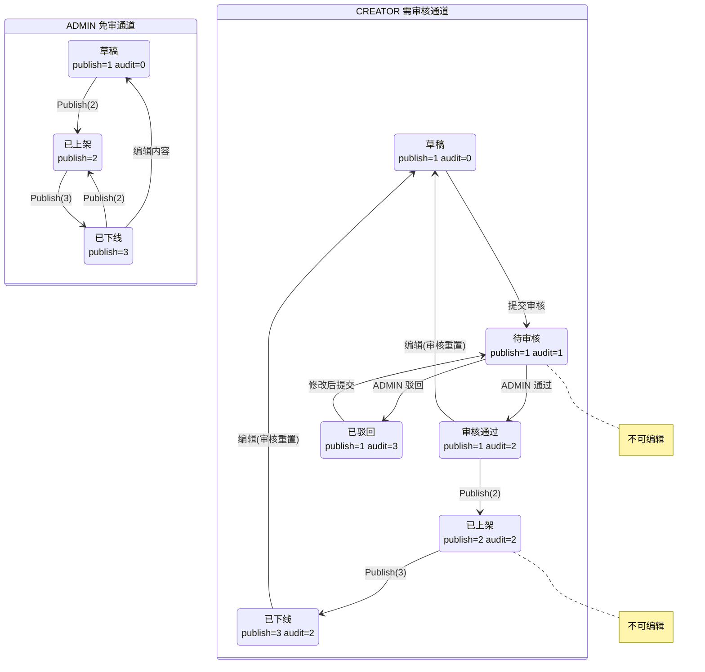

# 路线状态变化动线

> 对应代码：`CulturalTourismSystem.IService/IRouteDataPermissionService.cs` → `RouteWorkflowPolicy`  
> 核心实体：`CulturalTourismSystem.Model/DataBase/Puzzle.cs` → `PuzzleRoute`

---

## 1. 核心字段

| 字段 | DB 列 | 类型 | 含义 | 取值 |
|------|-------|------|------|------|
| `PublishStatus` | `publish_status` | `short` | 发布状态 | `1`=草稿, `2`=已上架, `3`=已下线 |
| `AuditStatus` | `audit_status` | `short` | 审核状态 | `0`=未提交, `1`=待审核, `2`=审核通过, `3`=已驳回 |
| `AuditRequired` | `audit_required` | `short` | 是否需审核 | `0`=免审（ADMIN 创建）, `1`=需审核（CREATOR 创建） |
| `OwnerId` | `owner_id` | `long` | 路线归属人 | `sys_admin.id` |

> **默认值**：新路线创建时 `PublishStatus=1`（草稿），`AuditStatus=0`（未提交）。

---

## 2. 两种角色路径

系统定义两种后台角色（`BackendRoleCodes`）：

| 角色 | 编码 | 审核要求 | 数据可见范围 |
|------|------|----------|-------------|
| 管理员 | `ADMIN` | **免审**（`audit_required=0`） | 所有路线 |
| 策展人 | `CREATOR` | **需审核**（`audit_required=1`） | 自己名下 + 已上架路线 |

> 创建路线时，`AuditRequired` 根据当前登录角色自动设定：ADMIN → `0`，CREATOR → `1`。

---

## 3. 状态变化动线

### 3.1 管理员（ADMIN）— 免审通道

```
创建 (publish_status=1, audit_required=0, audit_status=0)
  │
  ▼
┌──────────┐
│  草  稿   │ ← 可编辑内容，修改无需审核
└────┬─────┘
     │  Publish(2)
     ▼
┌──────────┐
│ 已上架   │ ← 不可编辑内容
└────┬─────┘
     │  Publish(3)
     ▼
┌──────────┐
│ 已下线   │ ← 可编辑内容，修改后可直接重新上架
└────┬─────┘
     │  Publish(2)
     └──────→ 【已上架】
```

- **无审核环节**：ADMIN 创建即免审，`CanPublish()` 始终返回 `true`。
- **上架/下架**：仅 ADMIN 本人可操作自己创建的免审路线。
- **编辑限制**：已上架（`publish_status=2`）时不可编辑；已下线（`publish_status=3`）可编辑。

---

### 3.2 策展人（CREATOR）— 需审核通道

```
创建 (publish_status=1, audit_required=1, audit_status=0)
  │
  ▼
┌──────────────┐
│  草  稿      │ audit_status=0, 可编辑
└──────┬───────┘
       │  ① 编辑内容 → audit_status 自动重置为 0
       │
       │  ② SubmitRouteAudit（提交审核）
       ▼
┌──────────────┐
│  待 审 核    │ audit_status=1, 不可编辑
└──┬───────┬───┘
   │       │
   │       └── ③ ADMIN 驳回 (audit_status=3)
   │                │
   │                ▼
   │           ┌──────────────┐
   │           │  已 驳 回    │ audit_status=3, 可编辑
   │           └──────┬───────┘
   │                  │ 修改后重新 ② 提交审核
   │                  └──→ 【待审核】
   │
   └── ③ ADMIN 审核通过 (audit_status=2)
          │
          ▼
       ┌──────────────┐
       │  审核通过    │ audit_status=2
       └──────┬───────┘
              │  Publish(2)（仅审核通过后可上架）
              ▼
       ┌──────────────┐
       │  已 上 架    │ publish_status=2, 不可编辑
       └──────┬───────┘
              │  Publish(3)
              ▼
       ┌──────────────┐
       │  已 下 线    │ publish_status=3, 可编辑
       └──────┬───────┘
              │ 修改内容 → audit_status 重置为 0
              │            → 需重新走 ②→③ 审核流程
              │
              └── 重新上架前必须再次审核通过
```

- **审核是发布的前置条件**：`CanPublish()` 仅在 `AuditRequired==0` 或 `AuditStatus==2` 时返回 `true`。
- **修改即失效**：`InvalidateAuditAfterContentChange()` 在内容变更时自动将 `AuditStatus` 重置为 `0`，清除审核人/审核时间/审核备注。
- **待审核时锁定**：`CanEditContent()` 在 `AuditStatus==1`（待审核）或 `PublishStatus==2`（已上架）时返回 `false`。

---

## 4. 关键约束速查表（RouteWorkflowPolicy）

| 操作 | ADMIN | CREATOR |
|------|-------|---------|
| **编辑内容** (`CanEditContent`) | ✅ 草稿/已下线 | ✅ 草稿(`audit=0`)/已驳回(`audit=3`)/已下线<br>❌ 待审核(`audit=1`)/已上架 |
| **提交审核** (`CanSubmitAudit`) | ❌ 免审，无需提交 | ✅ 自己的草稿或已驳回路线（未上架） |
| **审核路线** (`CanAudit`) | ✅ 仅待审核的策展人路线（列表「审核」= 只读打开详情，底部再通过/驳回） | ❌ |
| **上架/下架** (`CanChangePublication`) | ✅ 仅自己创建的免审路线 | ✅ 仅自己创建且审核通过的路线 |
| **上架前置** (`CanPublish`) | ✅ 始终可上架 | ✅ 仅审核通过(`audit=2`)后可上架 |
| **修改后审核失效** (`InvalidateAuditAfterContentChange`) | ❌ 不失效 | ✅ 自动重置 `audit=0` |

---

## 5. 完整状态机图



---

## 6. 权限码与操作映射

| 权限码 | 操作 | 需要角色 |
|--------|------|---------|
| `route:list` | 查看路线列表 | ADMIN / CREATOR |
| `route:view` | 查看路线详情 | ADMIN / CREATOR |
| `route:create` | 创建路线 | ADMIN / CREATOR |
| `route:edit` | 编辑路线内容 | ADMIN / CREATOR（受工作流限制） |
| `route:submit-audit` | 提交审核 | CREATOR |
| `route:audit` | 审核路线 | ADMIN |
| `route:publish` | 上架/下架 | ADMIN / CREATOR（各自名下） |
| `route:delete` | 删除路线 | ADMIN / CREATOR（仅草稿可删） |

> CREATOR 默认拥有：`route:list, route:view, route:create, route:edit, route:submit-audit, route:publish, route:delete`  
> ADMIN 默认拥有：`*`（通配，全部权限）

---

## 7. 数据可见性规则

| 角色 | 列表可见 | 详情可见 |
|------|---------|---------|
| ADMIN | 所有未删除路线 | 所有未删除路线 |
| CREATOR | 自己名下的路线 + 已上架(`publish=2`)路线 | 自己名下 + 已上架路线 |

```cs
// BuildViewPredicate 核心逻辑
ADMIN:    route => route.IsDeleted == 0
CREATOR:  route => route.IsDeleted == 0 && (OwnerId == userId || PublishStatus == 2)
```
