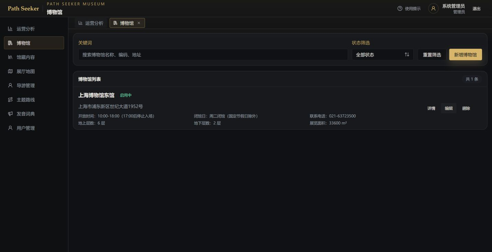
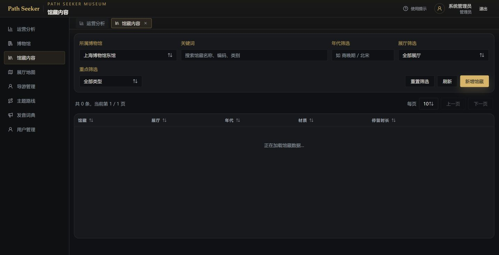
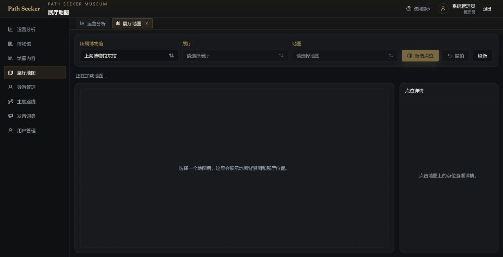
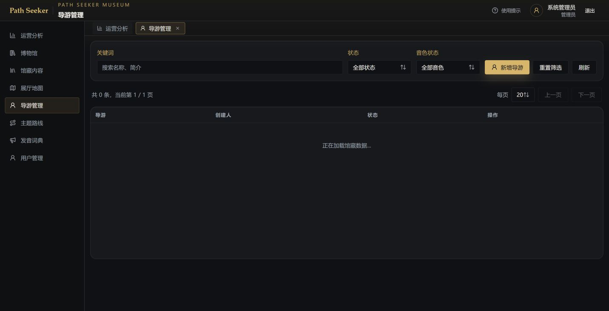
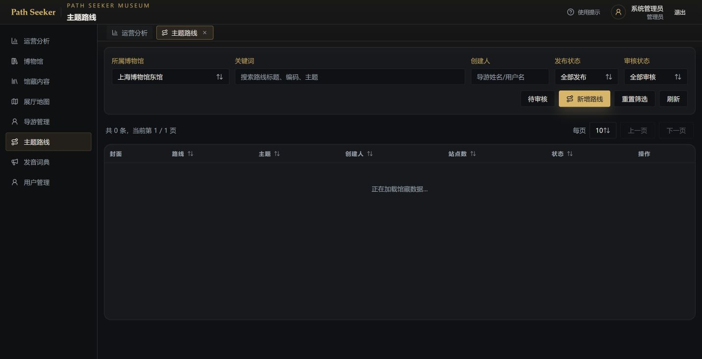
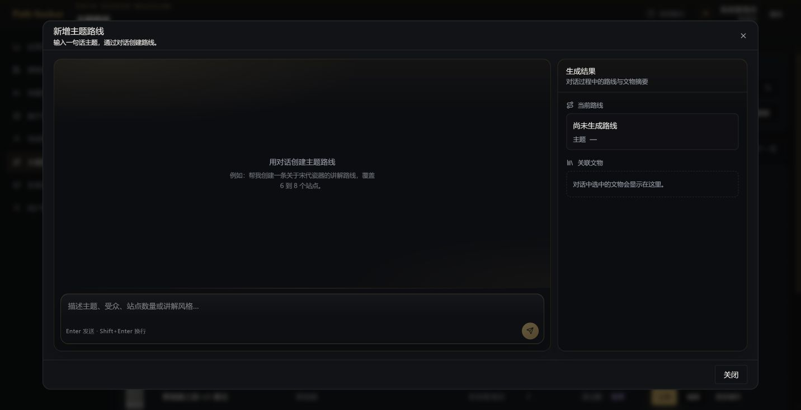
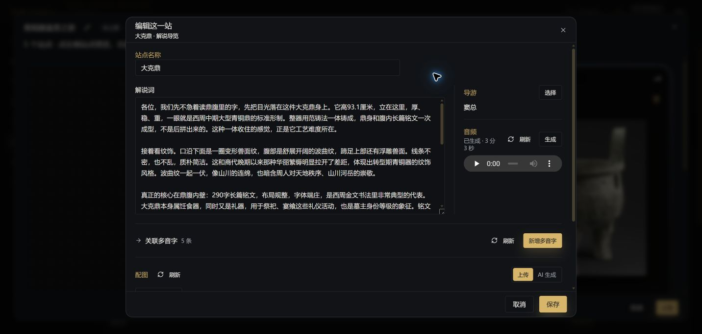
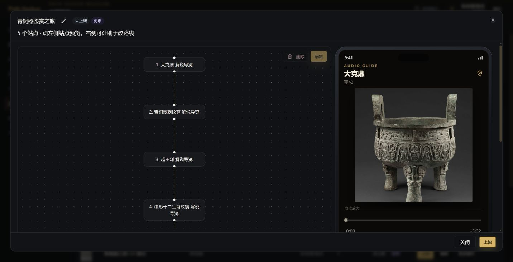
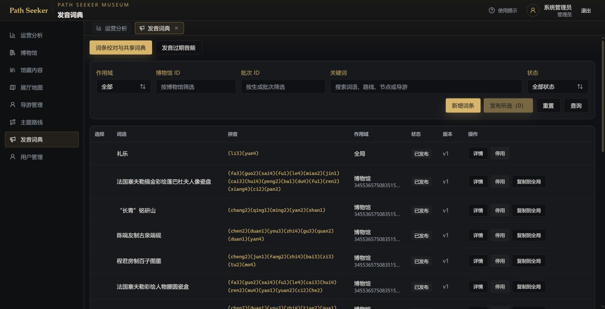
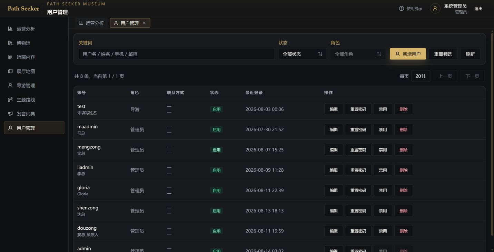

# Path Seeker 管理后台用户操作手册

> 适用对象：博物馆运营人员、路线策划人员、内容编辑人员和系统管理员。  
> 访问地址：<https://www.omahaaigc.com/path-seeker/admin/>  
> 文档更新时间：2026-08-14

## 1. 登录与界面概览

### 1.1 登录

1. 在浏览器打开管理后台地址。
2. 输入管理员账号 `test` 和密码 `test123456`。
3. 登录成功后进入“运营分析”。生产环境建议首次登录后立即修改密码，并避免在公共电脑保存密码。

### 1.2 主导航

左侧主导航包含：运营分析、博物馆、馆藏内容、展厅地图、导游管理、主题路线、发音词典和用户管理。页面右上角显示当前登录身份，可使用“退出”安全注销。

## 2. 运营分析

运营分析用于快速了解平台运行情况，包括用户总数、展品总数、路线总数、已发布路线、游玩次数、完成场次和完成率，并以“路线开始 / 完成”图表观察路线表现。

**常用操作**

- 打开“运营分析”查看当前概览。
- 单击“刷新”获取最新统计。
- 结合路线管理中的发布状态判断数据变化是否来自新路线上线。

统计页面适合日常巡检；具体内容编辑应进入对应业务模块完成。

## 3. 博物馆管理

1. 打开“博物馆”，先选择需要维护的博物馆或东馆。
2. 查看博物馆基本信息、馆区/楼层等配置。
3. 新建或编辑信息后，检查名称、地址、开放状态和关联内容，再保存。
4. 修改后回到“展厅地图”和“馆藏内容”确认关联关系没有断开。

建议先维护博物馆基础资料，再录入展品、展厅和路线，避免后续重复关联。

## 4. 馆藏内容（展品）

馆藏内容是路线站点和 Chat 生成内容的知识基础。

**查询与筛选**

- 使用关键词查找展品名称、编号或主题。
- 按朝代、类别、材质、所属展厅等条件缩小范围。
- 打开展品详情，核对标题、简介、图片、展厅位置和可用于路线的状态。

**编辑建议**

- 保持展品名称唯一且易搜索。
- 先完善事实信息，再让 Chat 生成路线或解说内容。
- 发现重复展品时，先确认是否为不同藏品，不要直接删除。

## 5. 展厅地图

1. 打开“展厅地图”，选择博物馆及楼层。
2. 查看或维护展厅、地图点位及点位与展品的关系。
3. 新增点位时，将点位拖到实际位置并绑定对应展品。
4. 保存后回到展品详情或路线预览，验证“查看展厅位置”能够定位到正确位置。

地图点位会影响游客导航和路线体验，调整前建议记录原位置。

## 6. 导游管理

导游资料用于音频解说的声音与风格。

- 查看导游名称、状态、音色和可用范围。
- 新增导游时填写清晰的显示名称，并按实际授权配置声音。
- 修改导游后，在路线解说设置中重新确认关联导游。
- 导游不可用时，先切换到其他可用导游，再重新生成音频。

## 7. 主题路线管理

### 7.1 查询路线

使用所属博物馆、关键词、创建人、发布状态和审核状态筛选。列表显示路线标题、主题、创建人、站点数和当前状态。分页时可调整每页数量，必要时点击“刷新”。

### 7.2 新增路线

单击“新增路线”后，按照“基础信息 → 站点内容 → 检查发布”的顺序完成创建。

新增路线窗口本身采用“输入一句话主题，通过对话创建路线”的方式。可以直接描述主题、受众、站点数量和讲解风格，由 Chat 生成路线草稿；生成结果会显示当前路线主题和关联文物，确认后再进入后续编辑。

#### 第一步：填写基础信息

1. **路线标题**：填写游客能够直接理解的名称，例如“青铜器礼制入门”。标题应简洁、唯一，避免使用“测试”“临时”等内部标记。
2. **路线主题**：说明路线希望传达的主题或故事线，例如“从礼器认识先秦社会”。主题会影响后续 Chat 生成内容的方向。
3. **所属博物馆**：选择实际承载展品和地图点位的博物馆。路线中的展品、展厅和导航位置应与此处保持一致。
4. **玩法类型**：根据游客体验选择玩法。常规路线可选择观察选择题、纹样拼图等互动形式；需要 AI 语音讲解的路线选择“边走边听”类玩法。玩法确定后，站点配置和发布检查项也会随之变化。
5. **保存草稿**：先保存为草稿，不要在基础信息尚未确认时直接上架。创建成功后记下路线名称，便于在列表中搜索。

> 如果使用新增路线窗口的对话创建方式，可将“标题、主题、博物馆、玩法类型、站点数量和受众”一次写清楚；生成后仍需回到路线详情逐项复核。

#### 第二步：补充站点

1. 打开刚创建的路线，进入编辑页面。
2. 新增站点并选择关联展品；每个站点应有清晰标题、明确目标和合理的游览顺序。
3. 根据玩法填写题目、选项、答案、提示、分值和是否必做等内容。
4. 对“边走边听”路线，先选择导游，再补充解说词和音频；所有站点完成后统一检查音频状态。
5. 使用 Chat 可以快速生成初稿，例如：

   > 为当前路线选择 6 件适合初中生的青铜器展品，按参观顺序生成 6 个站点；每个站点包含标题、一个观察问题和一个可验证的答案，先保存为草稿。

   > 根据当前路线主题，为缺少内容的站点补充 60 字以内的引导语，不修改已存在的答案和分值。

生成内容后必须逐站打开检查，重点核对展品是否对应、答案是否正确、题目是否可操作，以及站点顺序是否符合实际参观动线。

#### 第三步：预览并发布

1. 在路线编辑页查看完整站点列表，确认没有空站点、重复展品或无效关联。
2. 打开路线预览，从游客视角检查标题、封面、站点顺序、地图位置、题目交互和音频播放。
3. 发布前让 Chat 执行检查，例如：

   > 检查当前路线的基础信息、站点配置、关联展品、解说词和音频，列出所有阻塞发布的问题，不要上架。

4. 修复检查结果后再次预览；确认内容、事实和版权均无问题，再单击“上架”。
5. 上架后回到路线列表确认状态变为“已上架”，并在运营分析中观察后续游玩数据。

如果暂时不具备发布条件，可保留为草稿，之后通过关键词搜索路线继续编辑。涉及删除站点、批量修改或直接上架时，应先查看影响范围并进行人工确认。

#### 新增路线的状态校验清单

新增路线不建议只看“保存成功”提示，应按下面顺序确认状态：

| 阶段 | 列表/详情中应看到的状态 | 可以做什么 | 不应做什么 |
|---|---|---|---|
| 创建后 | 未上架；若仍在生成则显示“生成中”及进度 | 关闭窗口、刷新列表、继续编辑已完成内容 | 未完成生成时反复提交相同请求 |
| 草稿编辑 | 未上架，可编辑 | 补充站点、修改题目、调整顺序、生成解说 | 未检查站点就直接上架 |
| 提交审核（适用需要审核的路线） | 待审核；内容锁定 | 打开只读详情查看，等待审核结论 | 在锁定期间继续用 Chat 修改 |
| 审核通过 | 已通过审核，可执行上架 | 打开预览，确认后上架 | 跳过预览直接发布 |
| 审核驳回 | 驳回并显示审核原因 | 按原因修改，重新提交审核 | 只修改标题而忽略具体问题 |
| 已上架 | 已上架；内容通常不可编辑 | 面向游客提供路线，观察运营数据 | 未确认影响就下线 |
| 已下线 | 已下线，可重新编辑 | 修复内容后重新提交审核/上架 | 误以为下线等同于删除 |

“预发布”在后台实际体现为“未上架草稿”或“待审核/审核通过”阶段，不是另一个需要额外生成的后端状态。发布前至少完成一次路线预览、一次 Chat 发布前检查，并在列表中确认最终状态；异步生成中的路线要等到状态不再显示“生成中”后再进行最终校验。

### 7.3 编辑、预览与发布

打开某条路线的“编辑”或“查看”，先检查站点顺序、关联展品、解说文案和音频。发布前完成预览和校验；确认无误后单击“上架”。已上架路线使用“下线”，已下线路线使用“重新上架”。

#### 编辑这一站：解说词、导游、音频与配图

1. 在路线详情左侧选择一个站点，点击右侧工具栏的“编辑”，打开“编辑这一站”窗口。这里才是站点内容的实际编辑页面；中间的 C 端预览仅用于查看效果。
2. 在“站点名称”输入框修改站点名称，名称应与关联展品一致。
3. 在“解说词”文本框编辑完整正文，重点检查展品名称、年代、专有名词、数字、史实和游客可理解性。
4. 在“导游”区域点击“选择”，为当前站点选择讲解声音；切换导游后应重新确认音频是否仍然匹配。
5. 在“音频”区域查看当前生成状态。显示“已生成”后可点击播放器试听；点击“生成”用于提交新的音频生成任务，“刷新”用于查看异步任务完成结果。
6. 在“配图”区域选择“上传”或“AI 生成”，使用“选择图片”添加站点图片，并确认封面标记是否正确。
7. 所有修改确认无误后点击底部“保存”；点击“取消”则放弃本次窗口内的修改。
8. 保存后重新打开该站点，确认正文、导游、音频状态和配图均已持久化，再进行路线预览。

如果只更新文字，保存后先试听现有音频；如果正文、导游或发音发生明显变化，再使用“生成”重新提交音频。音频处于“生成中”时不要反复点击生成。

可使用 Chat 辅助生成编辑初稿：

> 将当前站点解说词改写为 80～100 字，先讲观赏重点，再讲历史背景，保留所有可核验事实，不改变展品名称。

生成内容不能直接替代人工审核；保存前应对照展品资料逐句确认。

#### 多音字与专名发音标注

站点编辑窗口中的“关联多音字”用于当前站点，发音词典页面则用于维护可复用的词条。站点窗口会显示当前已关联的数量，例如“关联多音字 5 条”，可点击“刷新”同步最新关联结果，或点击“新增多音字”补充局部读音。

发音词典页面用于维护可复用的专有名词和多音字读法。词条列表会展示“词语、拼音、作用域、状态和版本”，拼音以数字声调标记，例如 `礼乐` 显示为 `(li3)(yue4)`。

1. 打开“发音词典”，先用关键词搜索词语、路线、节点或导游。
2. 点击“新增词条”，填写需要固定读音的词语，并按字逐字填写拼音和声调。
3. 选择作用域：全局词条适用于所有路线；博物馆词条只影响指定博物馆内容。优先使用更准确、范围更小的作用域处理特殊读音。
4. 保存后检查词条状态和版本。确认无误后再发布；不要把尚未校对的词条直接发布为全局规则。
5. 已有词条可点击“详情”复核或修订；不再适用时使用“停用”。需要全局复用的博物馆词条可使用“复制到全局”，复制后仍要重新确认拼音。
6. 修改发音词条后，重新生成受影响站点的音频，并试听包含该词的句子；旧音频不会因为词典修改自动变更。

**当前站点关联多音字示例**

1. 打开“编辑这一站”窗口，点击“关联多音字”。
2. 先检查已有词条是否覆盖正文中的生僻字和多音字。
3. 点击“新增多音字”，填写词语、拼音和适用范围，保存后回到站点编辑窗口。
4. 点击“刷新”确认关联数量更新，再保存站点并重新生成音频。

**多音字标注示例**

> 为“重器”标注博物馆讲解读音 `zhong4 qi4`，仅作用于上海博物馆东馆，保存为待校对，不要发布全局。

> 检查当前路线解说词中的多音字和生僻字，列出可能误读的词语及推荐拼音，不要直接修改词典。

如果同一个词在不同语境读音不同，不要简单创建全局词条；应按博物馆或具体内容范围建立词条，并在音频中验证实际读法。

## 8. Chat 对话式路线编辑（重点）

Chat 位于路线编辑弹窗右侧，标题为“用对话编辑当前路线”。它会围绕当前选中的路线或站点执行查询、生成、修改、排序、配图管理和发布前检查。输入框下方提示：按 Enter 发送，按 Shift+Enter 换行。

### 8.1 使用前准备

1. 在“主题路线”列表中打开目标路线。
2. 在左侧站点列表选择需要处理的站点；不选站点时，消息作用于整条路线。
3. 确认当前博物馆、路线和导游上下文正确。
4. 用一句话说明目标、范围和限制；涉及删除、移动或发布时，先让 Chat 预览影响，再确认执行。

### 8.2 文物检索与统计

可直接输入以下示例：

> 搜索与“青铜礼制”相关的 10 件展品，并按朝代列出名称和展厅。

> 统计当前博物馆中材质为“青铜”的展品数量，并按朝代分组。

> 查看“大克鼎”的详细资料，给出适合 12 岁游客理解的事实摘要。

Chat 会先检索已有馆藏资料，再将结果用于后续路线编辑；找不到准确展品时，应改用完整名称或编号，不要凭记忆猜测。

### 8.3 创建路线与批量生成站点

**主题创建示例**

> 创建一条“青铜器礼制入门”路线，面向初中生，选择 6 件展品，设置 3 个必做站点，难度为中等，先保存为草稿。

**批量生成示例**

> 为当前路线中选中的 5 件展品各生成 1 个观察选择题站点，题干简短，答案必须能从展品资料中验证。

生成属于异步任务时，Chat 会返回进度或任务结果。等待完成后再打开路线预览，不要重复发送相同请求。

### 8.4 新增、修改和重排站点

**新增**

> 在当前路线末尾增加一个“青铜器纹饰观察”站点，关联云纹铜禁，玩法为观察选择题，设置为必做。

**精确修改**

> 将当前站点标题改为“先看纹饰，再猜用途”，只修改标题，其他配置保持不变。

**批量修改**

> 将第 2、3、4 个站点的分值统一调整为 10 分，保留原题目和答案。

**重排**

> 按“时代由早到晚、难度由低到高”重新排列当前路线站点，并先给出调整后的顺序。

**移动**

> 将当前站点移动到“青铜器进阶路线”的第 3 个位置，先说明会影响哪些路线。

对并发编辑或他人刚修改过的站点，先重新打开详情再提交，避免覆盖最新内容。

### 8.5 Agent 重写内容

**单站点重写**

> 保留当前题目的正确答案和玩法，将说明改写为 80 字以内、适合亲子游客的语气。

**批量重写**

> 重写当前路线所有站点的引导语：每条 40～60 字，语气生动，不增加资料中没有的事实。

重写后逐站检查事实、答案、分值和必做状态。Agent 生成内容应作为编辑初稿，不替代人工审核。

### 8.6 导游与解说词、音频

**选择导游**

> 查询可用的普通话女声导游，列出名称和适合的场景。

> 将当前路线解说导游切换为“窦总”，保持现有解说词不变。

**生成解说词**

> 为当前站点生成一段约 90 秒的展品解说，先讲看点，再讲历史背景，结尾给出一个观察提示。

**统一提交玩法 11**

> 当前路线所有解说站点已编辑完成，请按最终顺序统一生成解说词任务，并报告缺少文案的站点。

**仅重新生成音频**

> 仅为当前站点重新生成音频，不修改解说词正文。

**风格设置**

> 将当前站点解说风格调整为“亲切、节奏舒缓”，目标时长 90 秒，不改写正文。

### 8.7 Chat 配图管理

Chat 现在可以管理“边走边听”站点的配图，包括查看现有配图、添加图片、调整图片、删除图片、AI 生成图片和查询生成进度。操作前应在路线左侧选中目标站点，确认输入框上方已经显示正确的站点名称。

配图仍可在“编辑这一站”窗口中人工检查。窗口下方的“配图”区域提供“上传”和“AI 生成”两种来源，并显示当前图库；第一张图片会作为该站点的封面。

#### 查看当前站点配图

先让 Chat 列出图片，再决定修改对象。Chat 返回图片序号或缩略信息后，应根据图片内容确认，不要只凭“第一张”“最后一张”进行高风险操作。

> 列出当前站点的全部配图，按展示顺序说明哪一张是封面，并简要描述每张图。

> 当前站点共有几张配图？请检查是否存在重复图片或打不开的图片，不要修改。

#### 从剪贴板直接粘贴图片

Chat 输入框支持直接接收剪贴板中的图片，不需要先把图片保存为本地文件。适合粘贴截图、从图片编辑软件复制的画面，或在其他应用中执行“复制图片”后直接发送。

1. 在路线左侧选中目标站点，确认 Chat 输入框上方显示正确的路线和站点名称。
2. 在系统截图工具、浏览器、图片查看器或图片编辑软件中复制图片。Windows 通常使用 `Ctrl+C`，也可以截图后让图片保留在剪贴板中。
3. 点击 Chat 输入框，使光标停留在输入区域。
4. 按 `Ctrl+V` 粘贴图片。粘贴成功后，输入框上方会出现待发送的图片缩略图。
5. 检查缩略图是否正确。粘贴错误时，点击缩略图上的移除按钮，然后重新粘贴。
6. 输入对图片的用途和操作要求，再按 Enter 或点击“发送”。也可以只发送图片，但为了避免 Chat 误解用途，建议同时输入说明。

**支持范围与限制**

| 项目 | 限制 |
|---|---|
| 图片格式 | JPEG、PNG、WebP |
| 每条消息图片数量 | 最多 4 张；已引用的站点图片也会占用数量 |
| 单张图片大小 | 不超过 10 MB |
| 每条消息图片总大小 | 不超过 25 MB |
| 是否必须输入文字 | 不必须；但建议说明图片用途和目标站点 |

**粘贴后直接添加为站点配图**

> 将我粘贴的图片添加到当前站点，放在现有配图最后，不要替换封面。完成后列出新的图片顺序。

**粘贴后替换指定图片**

> 用我粘贴的高清图片替换当前站点第 2 张配图，保留原来的封面和其他图片顺序。执行前先描述当前第 2 张图片。

**粘贴后作为 AI 参考图**

> 以我粘贴的图片作为参考，为当前站点生成一张横版封面图。保持器物造型和纹饰准确，使用博物馆暖色灯光，不添加文字、水印或人物；生成完成后先预览，不要自动替换封面。

**一次粘贴多张参考图**

> 使用我粘贴的 3 张图片作为参考，生成一张突出器物正面造型和铭文细节的配图。不要修改或删除现有配图。

粘贴图片只会把图片附加到当前 Chat 消息中，不会在粘贴瞬间自动加入站点图库。必须在消息中明确要求“添加为配图”“替换图片”或“作为参考图生成”，并等待 Chat 返回执行结果。

如果粘贴后没有出现缩略图，应检查以下事项：

- 剪贴板中保存的是图片本身，而不是图片网址或文件路径。
- 图片格式属于 JPEG、PNG 或 WebP。
- 图片数量没有超过 4 张。
- 单张和总大小没有超过限制。
- Chat 当前没有处于发送中或禁用状态。
- 浏览器没有拦截剪贴板操作；必要时重新点击输入框后再按 `Ctrl+V`。

#### 添加已有图片

当图片已经上传到站点编辑窗口，或当前会话中已有可引用图片时，可要求 Chat 将其加入当前站点并指定展示位置。

> 把我刚刚上传的“大克鼎正面图”添加到当前站点，放在现有配图最后，不要替换封面。

> 将当前会话中的器物细节图添加为当前站点第二张配图，添加后列出新的图片顺序。

添加后打开“编辑这一站”，点击配图“刷新”，确认图片已经出现且顺序正确。

#### 调整配图或替换图片

可让 Chat 调整图片顺序、替换图片内容或将指定图片移到首位。第一张图片通常作为站点封面，因此调整到第一位前要明确说明目的。

> 将当前站点第 3 张配图移动到第 2 位，其他图片保持原顺序。

> 用我刚上传的高清图替换当前站点第 2 张图片，封面不变。

> 把“大克鼎全景图”设为第一张配图，并在执行前告诉我当前封面是哪一张。

执行后应重新列出图片顺序，并在 C 端预览中检查封面和轮播顺序。

#### 使用 AI 生成配图

生成请求应写清主体、构图、风格、用途和禁止出现的内容。需要保持器物外形时，可以指定现有配图或刚上传的图片作为参考图。

> 为当前站点生成一张横版配图：主体是展柜中的大克鼎，博物馆暖色灯光，写实摄影风格，画面简洁，不添加文字、水印或虚构纹饰。先提交生成任务，不要删除现有图片。

> 以当前站点第一张配图为参考，生成一张突出鼎腹铭文细节的近景图，保持器物造型和纹饰准确，不添加人物。

> 使用我刚上传的两张参考图，为当前站点生成一张适合作为封面的 16:9 图片；生成完成后先给我预览，不要自动替换封面。

AI 生成属于异步任务。提交成功不代表图片已经完成，也不代表已经通过人工审核。生成期间不要重复发送相同请求。

#### 查询图片生成进度

> 查询当前站点最近一次配图生成任务的进度和结果。

> 刚才的图片生成是否完成？如果失败，请说明失败原因，不要自动重试。

任务完成后，在“编辑这一站”的配图区点击“刷新”。确认生成图已绑定到正确站点，再查看大图和 C 端预览。

#### 删除配图

删除属于高风险操作。应先让 Chat 列出目标图片并说明删除后的封面和顺序变化，确认无误后再执行。

> 准备删除当前站点第 4 张配图。请先描述该图片，并说明删除后是否会影响封面，不要执行。

确认目标正确后：

> 确认删除刚才核对的第 4 张配图，其他图片顺序保持不变。完成后重新列出全部配图。

如果要删除当前封面，应先指定新的封面图片，再删除旧图，避免站点暂时没有有效封面。

#### 图片操作检查清单

| 检查项 | 操作要求 |
|---|---|
| 目标站点 | Chat 输入框上方显示的站点名称正确 |
| 粘贴附件 | 缩略图与预期图片一致，格式和大小没有超过限制 |
| 图片内容 | 展品、纹饰、铭文、颜色和历史场景没有明显事实错误 |
| 图片顺序 | 第一张封面正确，其余图片符合讲解顺序 |
| 生成状态 | 任务已完成；失败任务已说明原因，没有连续重复提交 |
| 版权与隐私 | 上传图片具备使用权限，不包含无关人物、个人信息或水印 |
| 发布前检查 | 已在“编辑这一站”和 C 端预览中分别检查一次 |

### 8.8 删除、发布和安全确认

推荐先使用预览式请求：

> 列出当前路线中可以删除的空站点，并说明删除后的顺序变化，不要执行删除。

确认无误后再发送：

> 删除刚才列出的第 5 个空站点，完成后重新检查站点顺序。

发布前：

> 检查当前路线的结构、站点配置、解说词和音频是否完整，列出所有阻塞发布的问题，不要上架。

修复问题后：

> 问题已处理，请再次校验当前路线；校验通过后提示我确认上架。

涉及删除、移动、批量修改和上架的操作，必须阅读 Chat 返回的影响范围和确认提示后再继续。

### 8.9 异步任务查询

当 Chat 返回“生成中”“排队中”或任务编号时，可输入：

> 查询当前路线最近一次生成任务的进度、结果和失败原因。

如需查询图片任务，可直接说明“配图生成任务”或使用 8.7 中的示例。任务失败时先根据失败原因修正素材、参考图或配置，再重新提交；不要连续重复点击发送。

## 9. 发音词典

用于维护专有名词、古文字、展品名称等播报读音。新增词条后，可在解说词生成或音频重新生成前检查读音是否命中。修改后建议抽听一条音频确认效果。

## 10. 用户管理

用户管理用于查询游客账号、状态和基础资料。处理用户问题时优先搜索用户，再查看其路线记录或完成情况；仅在确有管理需要时修改状态，避免误操作。

## 11. 推荐工作流

1. 维护博物馆、展厅地图和馆藏资料。
2. 在 Chat 中检索展品并创建路线草稿。
3. 生成或新增站点，人工检查题目、答案、关联展品和顺序。
4. 选择导游，生成解说词和音频；玩法 11 在所有站点完成后统一提交。
5. 使用路线预览和发布前校验发现问题。
6. 确认无误后上架，回到运营分析观察数据。

## 12. 常见问题

**Chat 没有发送按钮？** 先在输入框输入内容；按钮为空时会保持禁用。  
**生成任务很久没有完成？** 查询任务进度，确认素材、导游和音频配置，再决定是否重试。  
**路线发布失败？** 先让 Chat 执行发布前校验，按站点逐项修复缺少的配置、文案或音频。  
**误修改了内容？** 立即停止后续提交，重新打开路线或站点详情，核对最新版本再恢复。  
**看不到某个导游？** 检查导游状态和当前管理员可用范围，必要时联系系统管理员。

## 13. 安全与维护建议

- 不在手册、截图或工单中公开管理员密码。
- 删除、移动、批量修改和发布前，先预览影响范围并保留人工确认。
- AI 生成内容必须人工复核事实、版权、敏感表述和音频发音。
- 完成工作后退出账号，尤其是在共享设备上。
