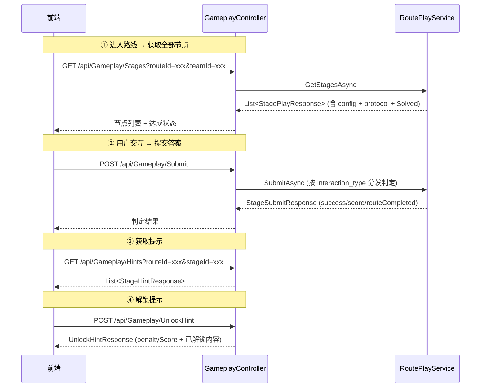

# 前端玩法对接文档

> 版本：2026-07-02 | 基于 `route_stage` 统一节点骨架

---

## 1. 核心概念

```
一条路线 Route = 多个节点 Stage（可混合不同玩法）
一个节点 Stage  = interaction_type 决定前端渲染组件 + 提交载荷格式
判定/得分/进度/成就 = 后端统一处理，前端无需关心
```

| 术语 | 含义 |
|------|------|
| `routeId` | 路线 ID（雪花ID字符串） |
| `stageId` | 节点 ID（雪花ID字符串，从 `Stages` 接口获取） |
| `interaction_type` | 玩法交互类型（1~9），决定前端渲染哪个组件 |
| `config` | 节点配置 JSON，各玩法结构不同（见第4节） |
| `payload` | 提交时发给后端的答案载荷，各玩法格式不同（见第4节） |
| `protocol` | 前端渲染/提交的协议元信息（`componentKey` 用于动态加载组件） |

---

## 2. C 端接口动线



### 2.1 接口一览

| 方法 | 路径 | 鉴权 | 说明 |
|------|------|------|------|
| `GET` | `/api/Gameplay/Stages` | 需登录 | 获取路线全部节点 + 用户达成状态 |
| `POST` | `/api/Gameplay/Submit` | 需登录 | 提交一个节点的交互结果 |
| `GET` | `/api/Gameplay/Hints` | 需登录 | 获取节点提示列表（含解锁状态） |
| `POST` | `/api/Gameplay/UnlockHint` | 需登录 | 解锁一条提示/线索（可能扣分） |

### 2.2 通用请求/响应外层

所有接口外层包裹 `ApiResponse<T>`：

```json
{
  "code": 0,
  "message": "success",
  "data": { ... }
}
```

---

## 3. 通用数据结构

### 3.1 获取节点 — 请求

```
GET /api/Gameplay/Stages?routeId={路线ID}&teamId={队伍ID}
```

| 参数 | 类型 | 必填 | 说明 |
|------|------|------|------|
| `routeId` | string | ✅ | 路线 ID（雪花ID） |
| `teamId` | string | ❌ | 队伍 ID，组队模式时传 |

### 3.2 获取节点 — 响应 `StagePlayResponse`

```json
{
  "stageId": "1234567890",        // 节点 ID（后续提交用）
  "stageNo": 1,                   // 阶段序号
  "sortOrder": 1,                 // 排序号
  "title": "大克鼎之谜",           // 节点标题
  "subtitle": "青铜器分类",        // 副标题
  "interactionType": 1,           // ★ 交互类型：1~9，决定渲染组件
  "refPuzzleId": "9876543210",    // 关联谜题 ID（答题型）
  "refExhibitId": "111222333",    // 关联文物 ID
  "unlockRule": 1,                // 解锁规则：1=顺序 2=自由 3=前置全部完成
  "isRequired": 1,                // 是否必答：1=必 0=可选
  "score": 10,                    // 该节点分值
  "config": "{...}",              // ★ 交互专属配置 JSON（各玩法不同，见第4节）
  "nextRule": null,               // 分支规则 JSON（剧情玩法用，通常为 null）
  "solved": false,                // ★ 当前用户是否已达成
  "protocol": {                   // ★ 前端渲染协议
    "interactionType": 1,
    "interactionCode": "answer",
    "componentKey": "gameplay-answer",
    "configSchemaVersion": "v1",
    "payloadSchemaVersion": "v1",
    "requiredConfigFields": [],
    "requiredPayloadFields": ["payload"]
  },
  "puzzleContent": "这件青铜器...", // 题面（答题型节点）
  "answerType": 1,                // 答案类型：1=文本 2=单选 3=数字 4=坐标 5=扫码
  "answerExtra": "{...}"          // 答案扩展（如单选题选项 JSON）
}
```

### 3.2.1 前端渲染协议 (`protocol`) 详解

`protocol` 是后端下发的**自描述元数据**，告诉前端「这个节点该用哪个组件渲染、提交时必填什么字段」。
前端不需要硬编码每种 `interaction_type` 的组件映射，而是动态读取 `componentKey` 加载组件。

**`StageProtocolResponse` 完整字段：**

```json
{
  "interactionType": 1,                   // 交互类型编号（1~9）
  "interactionCode": "answer",            // 交互类型英文标识，如 answer/password/sequence
  "componentKey": "gameplay-answer",      // ★ 前端据此动态加载组件，如 gameplay-answer → <AnswerGameplay />
  "configSchemaVersion": "v1",            // config 数据结构的协议版本（预留，当前固定 v1）
  "payloadSchemaVersion": "v1",           // payload 提交格式的协议版本（预留，当前固定 v1）
  "requiredConfigFields": [],             // config 中理论上必有的字段名列表（供调试校验参考）
  "requiredPayloadFields": ["payload"]    // ★ 提交时 payload 必须包含的 JSON 字段名，如 ["order"] / ["pairs"] / ["code"]
}
```

| 字段 | 类型 | 作用 | 前端用法 |
|------|------|------|----------|
| `interactionType` | short | 交互类型编号（1=Answer … 9=ShadowMatch） | 兜底判断（优先用 `componentKey`） |
| `interactionCode` | string | 交互类型英文标识，如 `"answer"` | 调试日志、埋点上报 |
| **`componentKey`** | string | **前端组件的动态加载 key** | 作为 key 从组件注册表中查找并渲染对应组件 |
| `configSchemaVersion` | string | config 结构版本号 | 预留，当前固定 `"v1"` |
| `payloadSchemaVersion` | string | payload 格式版本号 | 预留，当前固定 `"v1"` |
| `requiredConfigFields` | string[] | config JSON 中应有的字段名 | 开发调试时校验后端是否遗漏下发必要字段 |
| **`requiredPayloadFields`** | string[] | **提交时 payload JSON 必须包含的字段名** | 前端提交前可做本地校验，确保 payload 结构合法 |

**前端动态渲染伪代码：**

```typescript
// 组件注册表：componentKey → 组件
const componentRegistry: Record<string, Component> = {
  'gameplay-answer':       AnswerGameplay,       // 文本输入/单选/扫码
  'gameplay-password':     PasswordGameplay,     // N 位密码输入格
  'gameplay-sequence':     SequenceGameplay,     // 拖拽排序列表
  'gameplay-match':        MatchGameplay,        // 左右连线/点击配对
  'gameplay-select':       SelectGameplay,       // 网格多选
  'gameplay-jigsaw':       JigsawGameplay,       // 网格拖拽拼图
  'gameplay-sound-match':  SoundMatchGameplay,   // 音频+图片连线配对
  'gameplay-spot-diff':    SpotDiffGameplay,     // 图片点击找不同
  'gameplay-shadow-match': ShadowMatchGameplay,  // 剪影+原图配对
};

// 遍历节点，按 protocol.componentKey 动态渲染
function renderStage(stage: StagePlayResponse) {
  const component = componentRegistry[stage.protocol.componentKey];
  if (!component) {
    console.warn(`未注册的组件: ${stage.protocol.componentKey}`);
    return;
  }
  // 传入 config 作为渲染数据，protocol 作为提交约束
  render(component, {
    config: JSON.parse(stage.config),
    protocol: stage.protocol,
    stageId: stage.stageId,
    solved: stage.solved,
    onSubmit: (payload: object) => submitAnswer(stage, payload)
  });
}
```

**设计意图**：新增一种玩法只需后端加策略 + 前端在注册表加组件，不需要改接口结构。`componentKey` 和 `requiredPayloadFields` 让前后端通过协议自描述解耦。

### 3.3 提交答案 — 请求 `StageSubmitRequest`

```
POST /api/Gameplay/Submit
```

```json
{
  "routeId": "1234567890",        // 路线 ID
  "stageId": "1234567890",        // 节点 ID
  "teamId": null,                 // 队伍 ID（可选）
  "payload": "大克鼎",            // ★ 答案载荷（各玩法格式不同，见第4节）
  "durationSec": 30               // 本步骤耗时（秒，可选）
}
```

### 3.4 提交答案 — 响应 `StageSubmitResponse`

```json
{
  "success": true,                // 本次提交是否达成（答对/配对正确/拼图正确等）
  "scoreGained": 10,              // 本次获得分数（重复达成不再给分）
  "routeCompleted": false,        // 路线是否已完成（全部必达节点均达成）
  "nextStageId": null,            // 下一步骤 ID（分支玩法，通常为 null）
  "message": "回答正确！"          // 提示信息
}
```

### 3.5 提示 — 请求

```
GET /api/Gameplay/Hints?routeId={路线ID}&stageId={节点ID}&teamId={队伍ID}
```

### 3.6 提示 — 响应 `StageHintResponse`

```json
{
  "clueId": "h1",                 // 提示 ID（答题型=线索记录ID，互动型=hint_id）
  "stageId": "1234567890",
  "routeId": "1234567890",
  "clueNo": 1,
  "clueType": 1,                  // 1=文本 2=图片 3=音频 4=视频 5=AR/地图
  "hintLevel": 0,                 // 0=普通 1=观察 2=故事 3=直接（三级求助）
  "isHidden": 0,                  // 是否隐藏线索/秘密点
  "unlockMode": 1,                // 1=默认可见 2=答错N次后 3=消耗积分 4=超时后
  "unlockValue": 3,               // 解锁阈值（如答错3次）
  "penaltyScore": 5,              // 解锁扣分
  "sortOrder": 1,
  "content": "提示文本...",        // 文本内容（isUnlocked=false 时为 null）
  "mediaUrl": "https://...",      // 媒体 URL（isUnlocked=false 时为 null）
  "isUnlocked": true              // ★ 当前是否已解锁可见
}
```

### 3.7 解锁提示 — 请求

```
POST /api/Gameplay/UnlockHint
```

```json
{
  "routeId": "1234567890",
  "stageId": "1234567890",
  "teamId": null,
  "clueId": "h1",                 // ★ 提示 ID（来自 Hints 接口的 clueId）
  "hintId": null                  // 互动节点用 hint_id（与 clueId 二选一）
}
```

### 3.8 解锁提示 — 响应 `UnlockHintResponse`

```json
{
  "success": true,
  "penaltyScore": 5,              // 本次消耗/扣除分值
  "hint": { ... },                // 已解锁的提示内容（StageHintResponse）
  "message": "提示已解锁"
}
```

---

## 4. 九种玩法 — Config 与 Payload 详解

> **前端渲染规则**：根据 `protocol.componentKey` 加载对应组件，`config` 为组件渲染数据，`payload` 为提交格式。
> **安全约定**：`config` 下发时已脱敏，不包含正确答案。

### 玩法速查表

| type | interactionCode | componentKey | 玩法名称 |
|------|-----------------|--------------|----------|
| 1 | `answer` | `gameplay-answer` | 线性答题 |
| 2 | `password` | `gameplay-password` | 密符解锁 |
| 3 | `sequence` | `gameplay-sequence` | 时序重构 |
| 4 | `archive_match` | `gameplay-match` | 档案配对 |
| 5 | `select` | `gameplay-select` | 颜色寻宝 |
| 6 | `jigsaw` | `gameplay-jigsaw` | 纹样拼图 |
| 7 | `sound_match` | `gameplay-sound-match` | 听声配对 |
| 8 | `spot_diff` | `gameplay-spot-diff` | 大家来找茬 |
| 9 | `shadow_match` | `gameplay-shadow-match` | 影子归位 |

---

### 4.1 type=1 线性答题 (Answer)

**前端组件**：`gameplay-answer`

**config 结构**（`AnswerStageConfig`，已脱敏下发）：

```json
{
  "content": "这件青铜器铸造于哪个朝代？",     // 题面
  "answer_type": 2,                            // 1=文本输入 2=单选 3=数字 4=坐标 5=扫码
  "answer_extra": "{...}",                     // 单选题选项 JSON（answer_type=2 时有效）
  "hints": [                                   // 提示列表（可选）
    {
      "hint_id": "h1",
      "level": 0,
      "type": "text",
      "content": "提示内容...",
      "penalty_score": 5,
      "unlock_mode": 1,
      "sort_order": 1
    }
  ]
}
```

> **注意**：`config` 中已移除 `correct_answer` 和 `answer_match_mode`（脱敏）。

**answer_extra 示例**（单选题）：

```json
{
  "options": [
    { "key": "A", "text": "商代" },
    { "key": "B", "text": "西周" },
    { "key": "C", "text": "春秋" },
    { "key": "D", "text": "战国" }
  ]
}
```

**前端渲染建议**：
- `answer_type=1`：渲染文本输入框
- `answer_type=2`：渲染单选按钮组（从 `answer_extra.options` 读取）
- `answer_type=3`：渲染数字输入
- `answer_type=5`：渲染扫码输入

**提交 Payload**（纯文本）：

```json
{
  "payload": "B"    // 用户输入的答案（单选填选项key如"A"，文本填内容）
}
```

---

### 4.2 type=2 密符解锁 (Password)

**前端组件**：`gameplay-password`

**config 结构**：

```json
{
  "digits": 4,                                  // 密码位数（前端据此渲染 N 个输入格）
  "source_exhibit_ids": [101, 102, 103],        // 线索来源文物 ID 列表
  "rule_hint": "密码由四件文物的铸造年代尾数组成", // 规则提示（展示给用户）
  "clue_images": [                              // 线索细节图
    {
      "exhibit_id": 101,
      "url": "https://cdn.xxx/img1.jpg",
      "hint": "注意鼎腹纹饰"
    }
  ],
  "hints": [...]
}
```

> **注意**：`config` 中已移除 `code`（正确答案）和 `steps`（推导步骤）。

**提交 Payload**：

```json
{
  "payload": "{\"code\": \"1892\"}"    // JSON 字符串
}
```

Payload 解析后的结构：
```json
{
  "code": "1892"    // 用户输入的密码
}
```

---

### 4.3 type=3 时序重构 (Sequence)

**前端组件**：`gameplay-sequence`

**config 结构**：

```json
{
  "variant": "dynasty",                         // 变体：craft/dynasty/event
  "items": [                                    // 全部展示卡（含干扰卡）
    { "key": "a", "label": "商代青铜爵", "image_url": "https://..." },
    { "key": "b", "label": "西周大克鼎", "image_url": "https://..." },
    { "key": "c", "label": "春秋莲鹤方壶", "image_url": "https://..." },
    { "key": "d", "label": "战国铜冰鉴", "image_url": "https://..." }
  ],
  "hints": [...]
}
```

> **注意**：`config` 中已移除 `answer_order`（正确顺序）和 `distractors`（干扰卡标记）。

**前端渲染建议**：渲染一个可拖拽排序的卡片列表。

**提交 Payload**：

```json
{
  "payload": "{\"order\": [\"b\", \"a\", \"d\", \"c\"]}"    // 用户排列的 key 顺序
}
```

Payload 解析后的结构：
```json
{
  "order": ["b", "a", "d", "c"]
}
```

---

### 4.4 type=4 档案配对 (Match)

**前端组件**：`gameplay-match`

**config 结构**：

```json
{
  "dimension": "era",                           // 配对维度：author/era/material/function
  "left": [                                     // 左栏候选
    { "key": "l1", "label": "大克鼎", "image_url": "https://..." },
    { "key": "l2", "label": "莲鹤方壶", "image_url": "https://..." }
  ],
  "right": [                                    // 右栏候选
    { "key": "r1", "label": "西周", "image_url": null },
    { "key": "r2", "label": "春秋", "image_url": null }
  ],
  "hints": [...]
}
```

> **注意**：`config` 中已移除 `pairs`（正确配对映射）。

**前端渲染建议**：渲染左右两栏，用户连线/点击配对。

**提交 Payload**：

```json
{
  "payload": "{\"pairs\": {\"l1\": \"r1\", \"l2\": \"r2\"}}"
}
```

Payload 解析后的结构：
```json
{
  "pairs": {
    "l1": "r1",    // left.key → right.key
    "l2": "r2"
  }
}
```

---

### 4.5 type=5 颜色寻宝 (Select)

**前端组件**：`gameplay-select`

**config 结构**：

```json
{
  "theme": "找出所有青铜器",                     // 主题描述
  "min_pick": 2,                                // 最少需选中的数量
  "max_pick": 4,                                // 最多可选数量（null=不限）
  "candidates": [                               // 候选图列表
    { "key": "a", "label": "青铜鼎", "image_url": "https://..." },
    { "key": "b", "label": "青花瓷", "image_url": "https://..." },
    { "key": "c", "label": "青铜爵", "image_url": "https://..." },
    { "key": "d", "label": "玉璧",   "image_url": "https://..." }
  ],
  "hints": [...]
}
```

> **注意**：`config` 中已移除 `answer_keys`。

**前端渲染建议**：网格展示候选图，用户点击勾选，选够 `min_pick` 后提交按钮亮起。

**提交 Payload**：

```json
{
  "payload": "{\"picked\": [\"a\", \"c\"]}"
}
```

Payload 解析后的结构：
```json
{
  "picked": ["a", "c"]
}
```

---

### 4.6 type=6 纹样拼图 (Jigsaw)

**前端组件**：`gameplay-jigsaw`

**config 结构**：

```json
{
  "grid_rows": 3,                               // 网格行数
  "grid_cols": 3,                               // 网格列数
  "base_image_url": "https://cdn.xxx/base.jpg", // 底图 URL（可作半透明参考）
  "pieces": [                                   // 拼块列表
    { "key": "p1", "image_url": "https://cdn.xxx/p1.jpg", "correct_row": 0, "correct_col": 0 },
    { "key": "p2", "image_url": "https://cdn.xxx/p2.jpg", "correct_row": 0, "correct_col": 1 },
    { "key": "p3", "image_url": "https://cdn.xxx/p3.jpg", "correct_row": 0, "correct_col": 2 }
  ],
  "hints": [...]
}
```

> **注意**：`config` 中已移除 `answer_pieces`（正确排列顺序）。`correct_row`/`correct_col` 仅后台复核用，前端不暴露。

**前端渲染建议**：渲染 `grid_rows × grid_cols` 的网格，拼块初始随机排列或置于待拼区。用户拖拽到目标格。

**提交 Payload**：

```json
{
  "payload": "{\"pieces\": [\"p2\", \"p1\", \"p3\"]}"
}
```

Payload 解析后的结构：
```json
{
  "pieces": ["p2", "p1", "p3"]    // 每格当前的拼块 key，按从上到下、从左到右顺序
}
```

---

### 4.7 type=7 听声配对 (SoundMatch)

**前端组件**：`gameplay-sound-match`

**config 结构**：

```json
{
  "left": [                                     // 左栏（含音频 URL）
    { "key": "l1", "label": "编钟之声", "audio_url": "https://cdn.xxx/s1.mp3" },
    { "key": "l2", "label": "石磬之音", "audio_url": "https://cdn.xxx/s2.mp3" }
  ],
  "right": [                                    // 右栏（含图片 URL）
    { "key": "r1", "label": "曾侯乙编钟", "image_url": "https://cdn.xxx/img1.jpg" },
    { "key": "r2", "label": "虎纹石磬",   "image_url": "https://cdn.xxx/img2.jpg" }
  ],
  "hints": [...]
}
```

> **注意**：`config` 中已移除 `pairs`。

**前端渲染建议**：左栏渲染可点击播放的音频按钮，右栏渲染图片卡片。用户连线/点击配对。

**提交 Payload**：

```json
{
  "payload": "{\"pairs\": {\"l1\": \"r1\", \"l2\": \"r2\"}}"
}
```

Payload 解析后的结构：同 type=4 Match。

---

### 4.8 type=8 大家来找茬 (SpotDiff)

**前端组件**：`gameplay-spot-diff`

**config 结构**：

```json
{
  "base_image_url": "https://cdn.xxx/origin.jpg",     // 原图
  "altered_image_url": "https://cdn.xxx/altered.jpg", // 改动图
  "required_hits": 3,                                 // 需找到的差异数
  "tolerance": 0.05,                                  // 点击容差（归一化坐标，0.05=5%）
  "diffs": [                                          // 差异热区列表（后台校验用，前端不展示）
    { "key": "d1", "x": 0.25, "y": 0.30, "r": 0.05 },
    { "key": "d2", "x": 0.60, "y": 0.45, "r": 0.05 },
    { "key": "d3", "x": 0.80, "y": 0.70, "r": 0.08 }
  ],
  "hints": [...]
}
```

> **注意**：`diffs` 中的 `x`/`y`/`r` 是**归一化坐标**（范围 [0, 1]），前端根据图片实际尺寸 `×` 归一化值还原像素坐标。

**前端渲染建议**：并排或切换展示原图/改动图，用户点击差异位置。`required_hits` 表示需要找到多少个差异。

**提交 Payload**：

```json
{
  "payload": "{\"hits\": [{\"x\": 0.252, \"y\": 0.298}, {\"x\": 0.598, \"y\": 0.452}]}"
}
```

Payload 解析后的结构：
```json
{
  "hits": [
    { "x": 0.252, "y": 0.298 },    // 用户点击的归一化坐标
    { "x": 0.598, "y": 0.452 }
  ]
}
```

---

### 4.9 type=9 影子归位 (ShadowMatch)

**前端组件**：`gameplay-shadow-match`

**config 结构**：

```json
{
  "left": [                                     // 左栏（剪影图）
    { "key": "l1", "label": "剪影A", "silhouette_url": "https://cdn.xxx/shadow1.png" },
    { "key": "l2", "label": "剪影B", "silhouette_url": "https://cdn.xxx/shadow2.png" }
  ],
  "right": [                                    // 右栏（原图）
    { "key": "r1", "label": "大克鼎", "image_url": "https://cdn.xxx/img1.jpg" },
    { "key": "r2", "label": "爵",     "image_url": "https://cdn.xxx/img2.jpg" }
  ],
  "hints": [...]
}
```

> **注意**：`config` 中已移除 `pairs`。

**前端渲染建议**：左栏渲染剪影图，右栏渲染原图。用户连线/拖拽配对。

**提交 Payload**：

```json
{
  "payload": "{\"pairs\": {\"l1\": \"r2\", \"l2\": \"r1\"}}"
}
```

Payload 解析后的结构：同 type=4 Match。

---

## 5. 前端开发 Checklist

### 5.1 通用流程

- [ ] 进入路线 → 调 `GET /api/Gameplay/Stages` 获取节点列表
- [ ] 根据每个节点的 `interaction_type` + `protocol.componentKey` 动态加载对应玩法组件
- [ ] 节点 `solved=true` 时标记为已完成（禁用交互或展示已完成状态）
- [ ] 节点 `isRequired=0` 时标记为"可选"，不影响路线完成判定
- [ ] 用户提交答案 → `POST /api/Gameplay/Submit` → 根据 `success` 展示结果
- [ ] `routeCompleted=true` 时触发路线完成动画/弹窗
- [ ] 提示功能：`GET /api/Gameplay/Hints` → 展示可用提示 → `POST /api/Gameplay/UnlockHint` → 展示提示内容

### 5.2 组件映射

| componentKey | 建议前端组件名 |
|--------------|---------------|
| `gameplay-answer` | `AnswerGameplay` — 文本输入/单选/扫码 |
| `gameplay-password` | `PasswordGameplay` — N 位密码输入格 |
| `gameplay-sequence` | `SequenceGameplay` — 拖拽排序列表 |
| `gameplay-match` | `MatchGameplay` — 左右连线/点击配对 |
| `gameplay-select` | `SelectGameplay` — 网格多选 |
| `gameplay-jigsaw` | `JigsawGameplay` — 网格拖拽拼图 |
| `gameplay-sound-match` | `SoundMatchGameplay` — 音频+图片连线配对 |
| `gameplay-spot-diff` | `SpotDiffGameplay` — 图片点击找不同 |
| `gameplay-shadow-match` | `ShadowMatchGameplay` — 剪影+原图配对 |

### 5.3 注意事项

1. **Config 已脱敏**：`config` 下发时已移除正确答案字段（如 `correct_answer`、`code`、`answer_order`、`pairs`、`answer_keys`、`answer_pieces`），前端无需额外处理。
2. **Payload 格式**：所有玩法提交的 `payload` 字段都是 **JSON 字符串**（不是 JSON 对象），需 `JSON.stringify()` 后放入。
3. **阶段依赖**：`unlockRule=1` 表示须按序解锁，`solved=false` 的节点前端可禁用交互。
4. **重复提交**：已达成节点重复提交不会再次给分（`scoreGained=0`）。
5. **坐标归一化**：type=8 SpotDiff 的坐标均为归一化值 [0,1]，前端需根据图片实际渲染尺寸转换。

---

## 6. Admin 管理端接口（供后台参考）

| 方法 | 路径 | 说明 |
|------|------|------|
| `POST` | `/api/Gameplay/BuildStages` | 编排节点写入路线（覆盖式） |
| `POST` | `/api/Gameplay/StagePageList` | 分页获取路线节点 |
| `GET` | `/api/Gameplay/StageGet?id=xxx` | 获取单个节点详情 |
| `POST` | `/api/Gameplay/StageCreate` | 手动创建节点 |
| `POST` | `/api/Gameplay/StageUpdate` | 更新节点 |
| `POST` | `/api/Gameplay/StageDelete` | 软删除节点 |
| `POST` | `/api/Gameplay/AgentStageCreate` | Agent 单步生成节点 |
| `POST` | `/api/Gameplay/AgentBuildStages` | Agent 批量生成节点 |
